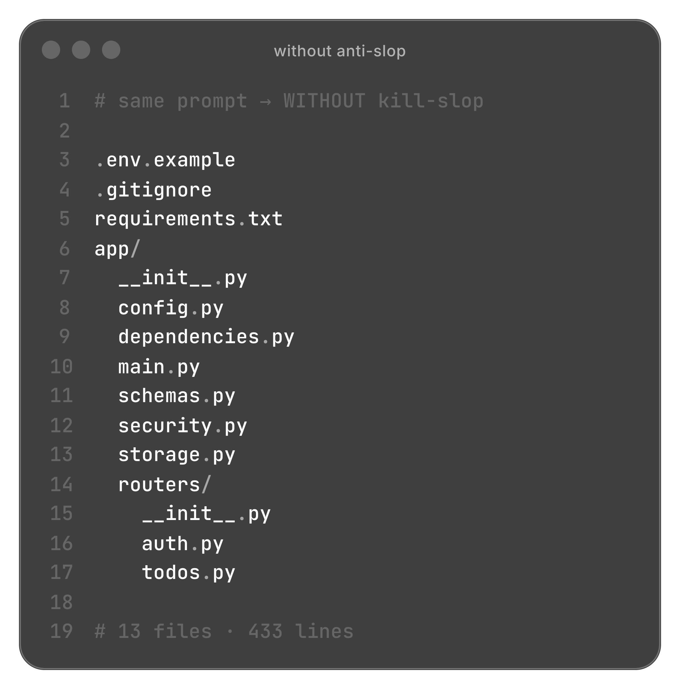
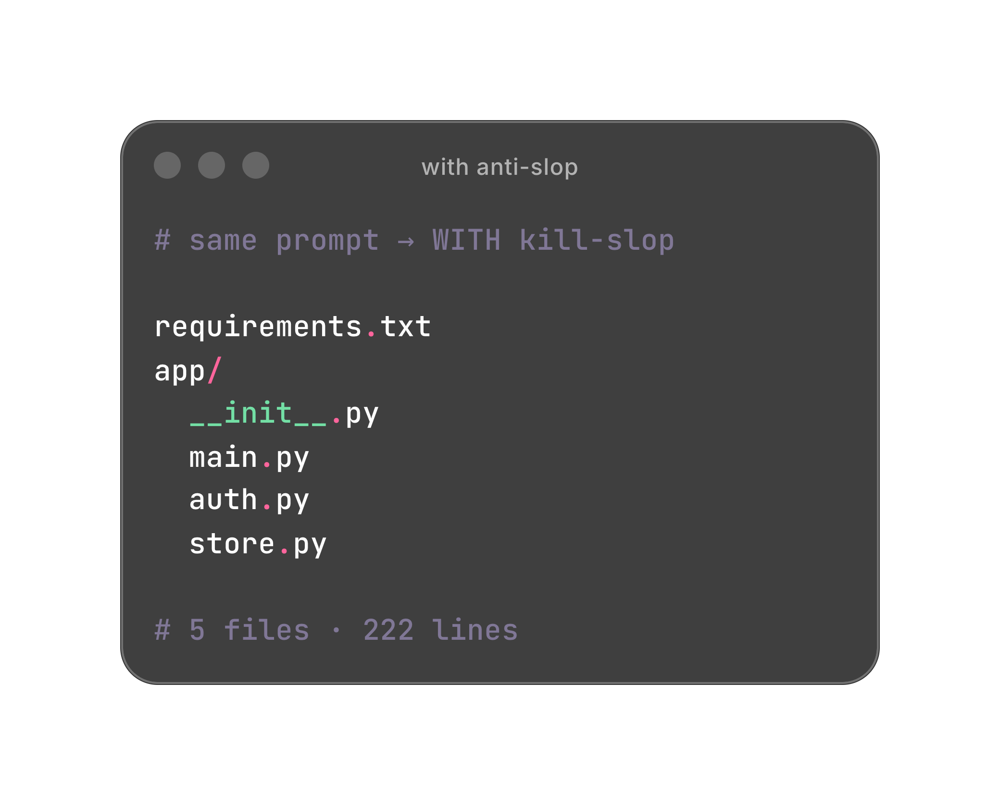

<div align="center">


# anti-slop

**Skills that stop AI coding agents from shipping garbage.**

Same prompt → smaller diffs. Less fake architecture. PRs you’d actually merge.

<br />

```bash
npx skills add iCodeCraft/anti-slop
```

<br />

[Cursor](https://cursor.com) · [Claude Code](https://docs.anthropic.com/en/docs/claude-code) · Codex · [70+ agents](https://github.com/vercel-labs/skills#supported-agents) · [Agent Skills](https://agentskills.io) · [MIT](./LICENSE)

</div>

---

## Same prompt. Half the slop.

Empty folder. Same model. One prompt:

> Create a production-ready FastAPI backend for authentication and a personal todo list.  
> I need register, login, create/list/toggle todos. In-memory storage is fine.

<p align="center">
  
  &nbsp;
  
</p>

<p align="center">
  <strong>13 files · 433 lines</strong>&nbsp;&nbsp;→&nbsp;&nbsp;<strong>5 files · 222 lines</strong>
  &nbsp;&nbsp;·&nbsp;&nbsp; <strong>−62% files · −49% lines</strong>
</p>

JWT auth and todos either way. anti-slop cuts the architecture cosplay — routers, schemas, dependencies, config theater → `main` + `auth` + `store`.

<details>
<summary>Reproduce the A/B</summary>

Prompt and notes: [`examples/README.md`](./examples/README.md). Results vary by model — a real run, not a guarantee.

</details>

---

## Why it exists

Agents overbuild. You correct the same junk every chat.

Extra files. Strategy patterns for one use. Comments that restate the code. Drive-by refactors. Clean Architecture on a todo app.

**anti-slop writes the rules down once.** The agent loads them when the task matches — not as a pasted paragraph you repeat forever.

---

## Three skills. One job each.

| | Skill | Does |
|:-:|:------|:-----|
| `/kill-slop` | [`kill-slop`](./skills/kill-slop/SKILL.md) | Minimal diffs. No drive-bys, junk comments, unrequested files/deps, or architecture cosplay. |
| `/security-review` | [`security-review`](./skills/security-review/SKILL.md) | Diff-scoped findings: authz, injection, secrets, SSRF, unsafe defaults. |
| `/pr-hygiene` | [`pr-hygiene`](./skills/pr-hygiene/SKILL.md) | Tight scope, honest PR body, no leftover debug. |

New session → skills load when relevant, or type the command.

<details>
<summary>What <code>kill-slop</code> forbids</summary>

- New files that could live in an existing one
- Dependencies you didn’t ask for
- Unrelated refactors
- Obvious comments (`// return result`)
- Abstractions for a single use
- Invented `domain/` / `application/` / `infrastructure/` trees
- Fishing outside the workspace for “inspiration”

Full playbook: [`skills/kill-slop/SKILL.md`](./skills/kill-slop/SKILL.md).

</details>

<details>
<summary>What <code>security-review</code> catches</summary>

Diff-scoped — not a whole-repo audit. Example: [`examples/security-review`](./examples/security-review/README.md).

```ts
// Looks fine. Ships a data leak.
app.get("/api/invoices/:id", async (req, res) => {
  const invoice = await db.invoices.findById(req.params.id);
  if (!invoice) return res.status(404).end();
  return res.json(invoice); // no ownership check
});
```

`/security-review` flags **missing authorization** — client-supplied id ≠ proof of access.

</details>

---

## Install

```bash
npx skills add iCodeCraft/anti-slop
```

```bash
# pin an agent
npx skills add iCodeCraft/anti-slop -a cursor -y
npx skills add iCodeCraft/anti-slop -a claude-code -y

# every project on this machine
npx skills add iCodeCraft/anti-slop -g -y

# manage
npx skills list
npx skills remove kill-slop
```

<details>
<summary>Where skills land</summary>

| Tool | Project | Global |
|------|---------|--------|
| Cursor | `.agents/skills/` | `~/.cursor/skills/` |
| Claude Code | `.claude/skills/` | `~/.claude/skills/` |
| Codex / others | `.agents/skills/` | under `~/` |

Portable via the [skills CLI](https://github.com/vercel-labs/skills) — no Cursor-only lock-in.

</details>

---

<div align="center">

**Contributing** · keep skills focused · MUST/NEVER over essays · [`CONTRIBUTING.md`](./CONTRIBUTING.md)

</div>
